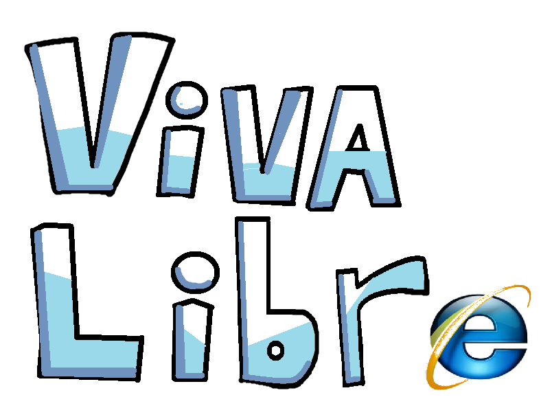

# Cross-Platform* Mod Menu Project for Wobbly Life
Made for [MelonLoader](https://melonwiki.xyz/#/)/[LemonLoader](https://melonwiki.xyz/#/android/general) 0.6.5

# Mods
- Gameplay Mods (modify the player or game state)
- Client Mods (modify your own client and save files)
- Prop Spawner (doesnt work)

# Credits
- [lstwoMods](https://lstwomods.github.io/) (viva libre is a simple, easy to use, cross-platform port of lstwoMods)

*Currently supports the steam version of wobbly life (if you wanna help out on any version regardless of modding expirence or not, dm me on discord @freakycheesy)
